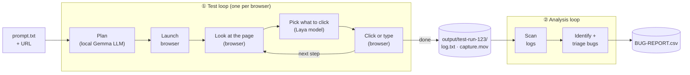

# Laya Ultrafast ⚡

**Lightning-fast browser-use automation with [Laya](https://github.com/mizorewww/laya-mlx), running free on localhost.** Give it a URL and one goal in plain English. A local agent drives a real browser to reach the goal, then checks the final page itself.

> [!IMPORTANT]
> **Apple Silicon only.** Laya runs through [laya-mlx](https://github.com/mizorewww/laya-mlx), which needs an M-series Mac, macOS 14+, and Python 3.11+ (this project uses 3.12+).

## What is Laya?

[Laya](https://github.com/NandhaKishorM/laya) is an open-weight model from Convai Innovations. This project runs it through **[laya-mlx](https://github.com/mizorewww/laya-mlx)**, an independent MLX port, with the **`aac6fef/laya-typed-decisions-mlx`** checkpoint (421M parameters, 1,024-token context). The checkpoint is trained for _typed decisions_: given a short question and a list of candidates, it picks one. The laya-mlx README covers requirements, checkpoints, benchmarks and troubleshooting.

Here, Laya chooses each browser action on your Mac:

- **No decision API and no per-step cost.** Each decision is a local forward pass. The median is about 33 ms on an M1 Max.
- **One text-model call per task.** An OpenAI-compatible model (gemma4 through local Ollama by default, or a hosted endpoint such as OpenRouter) turns the goal into field values, the item to open, and a finish condition. With a local text model, the whole agent runs offline, apart from the websites it browses.
- **Narrow questions, generic rules.** Laya answers narrow questions well: which field is the destination, whether `Tue, Oct 20` matches `October 20, 2026`, which suggestion is London. It does not reliably answer the open question "what should the browser do next?". So [`laya_ultrafast/laya.py`](laya_ultrafast/laya.py) combines narrow Laya questions with rules that apply on any site:
  1. Fill the values the goal states. Laya maps each one to a field, and Laya or plain code checks it.
  2. After typing or opening a control, choose from the options that appeared.
  3. Submit, then open the item the goal names, or wait for results that name the requested values.
- **Optional hosted mode.** Set `DECISION_MODEL=typesafe` to use the hosted [TypeSafe](https://docs.typesafe.ai/introduction) policy instead of Laya.

### How it works

Everything runs on your Mac. The agent repeats steps 2–4 until the goal is done.



Each loop reads the page into a table of indexed elements, asks for one operation plus a target from that table, and executes it. **Every target is an element the agent observed on the page.** The model never emits selectors or code, and there are no site-specific plans.

Goals that are a series of actions on controls ("launch the chat widget, start a call, end it, close it") get ordered steps from the planning call, together with the labels each control probably shows. Then, for each step:

1. If a visible control's label names the step, the agent clicks it. Local Laya breaks ties.
2. If nothing matches after a short wait, the text model gets the step and the visible controls, and picks one control or none. This happens at most 3 times per step, and the answers are cached.
3. If the click opens a confirmation (for example "Yes, Start a call") or a Send button, the agent clicks that too.
4. Before acting, the agent waits for the page to settle. A click that visibly changes nothing is tried again (up to 3 tries), because controls can appear before they work.
5. Typed text counts as done only once it appears on the page outside the message box. If a form reset wipes it, the agent types it again.
6. A step whose control never appears is skipped. A step with text to type is never skipped just because the next step's control appeared.

## Installation

Every step below is a plain command. Run them in order once per machine, and run every command in this README from the repository root.

### What you need

| Requirement                                | Why                                                                                                                                                                |
| ------------------------------------------ | ------------------------------------------------------------------------------------------------------------------------------------------------------------------ |
| Apple Silicon Mac (M1 or later), macOS 14+ | Laya runs on the GPU through [MLX](https://github.com/ml-explore/mlx), Apple's array framework for Apple Silicon. Intel Macs and other platforms are not supported |
| [Homebrew](https://brew.sh)                | Installs every tool below                                                                                                                                          |
| Google Chrome                              | The default test browser                                                                                                                                           |
| About 15 GB of free disk                   | gemma4 (9.6 GB), the Laya checkpoint (1.6 GB), Python packages and run videos                                                                                      |
| Firefox, Microsoft Edge                    | Optional, only if you enable them in `.env`                                                                                                                        |

### 1. Homebrew tools

```bash
# Homebrew itself, if `brew --version` fails (follow the "Next steps" it prints to add brew to your PATH)
/bin/bash -c "$(curl -fsSL https://raw.githubusercontent.com/Homebrew/install/HEAD/install.sh)"

brew install uv ffmpeg
brew install --cask google-chrome        # skip if Chrome is already in /Applications
```

- **`uv`** manages Python and the project's virtual environment. You do not need to install Python yourself: `uv` downloads Python 3.12+ on first use.
- **`ffmpeg`** encodes each run's `capture.mov`. Without it, set `RECORD_VIDEO=false`.

### 2. Ollama and the text model

The text model plans each task once. It runs locally through [Ollama](https://ollama.com), which must be **0.20 or newer** for gemma4.

```bash
brew install --cask ollama-app           # the Ollama Mac app plus the `ollama` command
# If an older Ollama.app is already installed by hand, add --force to replace it.
ollama --version                         # must print 0.20.0 or newer
open -a Ollama                           # starts the server on http://localhost:11434
curl -s http://localhost:11434/api/version
ollama pull gemma4:latest                # 9.6 GB, once
```

### 3. Clone the project and install Python dependencies

```bash
git clone https://github.com/spencerlepine/e2e-ui-test-laya.git
cd e2e-ui-test-laya
uv sync
```

`uv sync` creates `.venv` with Python 3.12+ and installs the pinned dependencies from `uv.lock`, including [`laya-mlx`](https://github.com/mizorewww/laya-mlx) (which pulls in MLX), [Browser Harness](https://github.com/browser-use/browser-harness) (the Chrome and Edge connection) and the Hugging Face `hf` command.

### 4. Laya checkpoint

```bash
uv run hf download aac6fef/laya-typed-decisions-mlx
```

This downloads the checkpoint (1.6 GB) once to `~/.cache/huggingface/hub/`. Later runs load it from there and need no network for decisions.

### 5. `.env`

`.env` is committed and needs no edits: it points at local Laya, local Ollama and the test Chrome, and holds no keys. Usage step 0 below covers the settings you may want to change. If it is ever missing, recreate it from the template and point it at Ollama:

```bash
sed -e 's#^TEXT_MODEL_BASE_URL=.*#TEXT_MODEL_BASE_URL=http://localhost:11434/v1#' \
    -e 's#^TEXT_MODEL=.*#TEXT_MODEL=gemma4:latest#' .env.example > .env
```

### 6. Test browsers

The committed `.env` points the agent at a **dedicated test Chrome** on port 9333 (`BU_CDP_URL=http://127.0.0.1:9333`). Start it:

```bash
scripts/test_chrome.sh                   # no-op if already running; --stop quits it
```

It has its own profile (`~/.laya-ultrafast/test-chrome`), separate from your everyday Chrome, and **never shows a permission prompt**:

- **Microphone and camera** are allowed and replaced with fake devices (a tone and a test pattern), so a voice or video test never uses your real microphone or camera.
- **Notifications and location** prompts are denied automatically.

Optional browsers:

```bash
brew install --cask firefox              # for FIREFOX_ENABLED=true
brew install --cask microsoft-edge       # for EDGE_ENABLED=true
```

- **Firefox** runs over WebDriver BiDi. Each run launches `/Applications/Firefox.app` (tested with 156) with a throwaway profile and quits it at the end, even if the run crashes. Your everyday Firefox is untouched. There is nothing to start.
- **Edge** is Chromium, so it is driven exactly like Chrome, through its own test Edge (`scripts/test_edge.sh`, port 9334, profile `~/.laya-ultrafast/test-edge`). Runs start it automatically.

To drive your everyday Chrome instead of the test Chrome, delete the `BU_CDP_URL` and `BU_NAME` lines from `.env`, open Chrome, and turn on remote debugging at `chrome://inspect/#remote-debugging`.

### 7. Verify the install

```bash
uv run pytest -q                                            # offline: a fake stands in for Laya; no downloads or paid calls
uv run python -c "import laya_mlx, mlx.core as mx; print('MLX', mx.__version__, mx.default_device())"
ollama list | grep gemma4
curl -s http://127.0.0.1:9333/json/version | grep Browser   # the test Chrome answers
```

### Before every session

Ollama unloads idle models, and a cold gemma4 load can take longer than the planner's 25-second timeout, which fails the run with `Model connection failed`. Before a session, make sure Ollama and the test Chrome are up, and load gemma4 for the next 60 minutes:

```bash
open -a Ollama
curl -s http://localhost:11434/api/generate -d '{"model":"gemma4:latest","keep_alive":"60m"}' >/dev/null
scripts/test_chrome.sh
```

## Usage

### 0. Configure `.env`

The committed `.env` runs fully locally (Laya plus gemma4 through Ollama) and holds no keys. Choose the browsers and how to watch them:

```bash
# false: watch the agent's tab (Chrome, Edge) or window (Firefox)
HEADLESS_MODE=false
CHROME_ENABLED=true
FIREFOX_ENABLED=true
# Needs Microsoft Edge installed
EDGE_ENABLED=false
# Record each run to capture.mov
RECORD_VIDEO=true
```

With several browsers enabled, every command runs the test in each of them **one after another**, in the order Chrome, Firefox, Edge. A browser starts only after the previous one has finished; runs never overlap. To run one browser only for a single command, add `--browser chrome`, `--browser firefox` or `--browser edge`. Shell variables override `.env`, so `HEADLESS_MODE=true uv run ...` works for one run.

### 1. Run a test

For a chat widget, run `examples/chat_widget.py`. It runs the agent, then checks the outcome from the browser itself, not from the agent's own "done":

```bash
uv run --env-file .env python examples/chat_widget.py \
  --url 'https://tinyurl.com/ye29e563' \
  --goal 'Launch the chat widget, start a conversation, send "Hello, World!", end the chat, close the widget.' \
  --expect 'Hello, World!' --expect-ended --expect-closed
```

Choose the checks that fit your goal:

| Flag                         | Passes when                                                                                                    |
| ---------------------------- | -------------------------------------------------------------------------------------------------------------- |
| `--expect TEXT` (repeatable) | the widget shows `TEXT` as its own line, such as a sent message, and it is not just sitting in the message box |
| `--expect-gone TEXT`         | no widget shows `TEXT` at the end, for example a call screen that closed                                       |
| `--expect-ended`             | the widget said the chat or call ended                                                                         |
| `--expect-closed`            | the tab is still on the start page and no widget is visible at the end                                         |

Every run also checks that a widget opened. The run prints each executed action, then JSON with `"passed"` and each check. **The exit code is 0 only if every check passed in every enabled browser.**

More verified goals on the same widget:

```bash
# Voice escalation: Keypad appears on the call screen, and must be gone once the call ends.
uv run --env-file .env python examples/chat_widget.py --url 'https://tinyurl.com/ye29e563' \
  --goal 'Launch the chat widget, start a conversation, click escalate to voice button, end the voice call, close the widget' \
  --expect Keypad --expect-gone Keypad --expect-closed

# Send an emoji: 😃 must appear in the transcript, not just in the picker.
uv run --env-file .env python examples/chat_widget.py --url 'https://tinyurl.com/ye29e563' \
  --goal 'Launch the chat widget, open the emoji picker, and send the smiley face emoji' \
  --expect '😃'
```

With all three browsers enabled, the output looks like this. Each line is prefixed with its browser, and the summary comes after the last run:

```
[chrome ] Run output: output/<time>-chrome-test-<id>
...
[firefox] Run output: output/<time>-firefox-test-<id>
...
[edge   ] Run output: output/<time>-edge-test-<id>
...
chrome: PASSED
firefox: PASSED
edge: PASSED
```

Other runners:

| Scenario                               | Command                                                                              |
| -------------------------------------- | ------------------------------------------------------------------------------------ |
| Any site and goal                      | `uv run --env-file .env python examples/run.py --url URL --goal 'A narrow goal'`     |
| Google Flights (checks the final page) | `uv run --env-file .env python examples/flights.py --date 2026-10-20 --keep-open`    |
| Skyscanner (checks the final page)     | `uv run --env-file .env python examples/skyscanner.py --date 2026-10-20 --keep-open` |
| Web demo UI (Chrome only)              | `uv run --env-file .env laya`, then open http://127.0.0.1:8766                       |

`examples/run.py` exits 0 only when the agent chose DONE. It does not check the outcome, so check that yourself. Flight sites only offer future dates, so pass `--date` (default: 30 days ahead). The flight examples never select or book a flight. Skyscanner may show a robot check, especially to headless browsers; the agent does not try to get past it.

### 2. Review a run

Every run writes one folder per browser and prints its path as `Run output:`:

```
output/2026-09-22_08-16-27-751-edge-test-081b13/
  prompt.txt    the --url and --goal you passed
  log.txt       for an AI agent: intent and plan, expected checks, every executed step, the actual result
  capture.mov   for a person: the agent's tab at its original speed
```

`log.txt` starts with a header (timestamp, browser and version, Laya and text models, total length), then the plan, the expected checks, and each step with its offset into the video, so a reviewer can jump straight to a click:

```
STEPS
  t= 42480 video=00:07.7  #4  CLICK     "Start Chat"  confidence=1.00  page changed: yes
  t= 46744 video=00:12.0  #10 CLICK     "EMOJIS"  confidence=1.00  page changed: yes
  t= 49226 video=00:14.5  #14 CLICK     "😃, smiley"  confidence=1.00  page changed: yes
  t= 50064 video=00:15.3  #16 CLICK     "Send Message"  confidence=1.00  page changed: yes

ACTUAL
  agent status: done  (DONE is the agent's claim, not proof)
  elapsed: 50.5 s  actions: 4  waits: 14  decisions: 22  text-model calls: 4
  checks:
    PASS launched
    PASS expect '😃'

RESULT: PASSED
```

- **`capture.mov`** is the browser's own screencast of the agent's tab, including widgets in iframes. It records the same way in front or in the background, and a run's video shows only its own tab.
- **The video starts at the agent's first action,** after planning, so it skips the 10–25 s planning wait.
- **Recording never changes a result.** If it fails, the log's `video:` line says why. Set `RECORD_VIDEO=false` to skip the video; `prompt.txt` and `log.txt` are still written.
- The chat-widget runner also writes a full trace to `artifacts/chat_widget/<time>-<pid>/state.json`: the plan, every decision, and the element table and widget text at each step. Use it to see what a new widget offers.

### Running several browsers

Browsers run sequentially, never in parallel, because their test suites conflict at runtime when they overlap. Each run is its own process with its own tab (or its own Firefox), its own copy of Laya and its own run folder. A failure in one browser does not stop the next; the exit code is 0 only if every browser passed. Do not start two test commands at the same time either.

### Several tabs: a customer and an agent in one test

`examples/multi_tab.py` drives several named tabs from one goal, for example an Amazon Connect chat widget as the customer and the agent chat UI (CCP) as the agent. With no arguments it runs this scenario:

```bash
uv run --env-file .env python examples/multi_tab.py \
  --expect 'customer widget=Hello from the agent' --expect 'agent chat UI=confirm' \
  --expect-ended 'customer widget' --expect-closed 'customer widget'
```

Its built-in goal: in the customer widget, launch the chat. In the agent chat UI, log in if needed, set the status to Available if needed, accept the chat and send "Hello from the agent". Back in the widget, wait for that reply, send "confirm", end the chat and close the widget. For your own tabs and goal, pass `--tab 'NAME=URL'` once per tab (the first is tab 1) and a `--goal` that names the tabs.

- **Nothing orders the tabs in code.** The text model plans once: one call splits the goal into parts by tab, then one call per part lists its steps (about 45 s with gemma4 for this goal). Each step names its tab. The agent observes every tab each time and acts on the tab of the current step, so it switches tabs whenever the plan does.
- **Waiting on the other tab.** A step can wait until its tab shows some text (the agent's reply). Controls that depend on the other tab through the backend (a chat offer) get about 30 s to appear instead of 8 s, and when a later step's control appears first (the offer arrives while the agent is already Available), the steps in between are skipped.
- **"If needed" steps** (log in, set Available) are done only when their control shows. The text model never guesses a control for them.
- **Logins stay out of logs.** Write a login value as `{{NAME}}` in the goal and list `NAME` in `LAYA_CREDENTIALS`. The planner, decisions, `log.txt` and traces keep the reference, and the value is read from `.env` just before typing. A name containing `PASSWORD` is typed only into a password field, and password fields are observed without reading their value.
- **Personas: one foundation script per page, chosen from each tab's URL** ([`examples/personas.py`](examples/personas.py)):

  | URL | Persona | Script |
  | --- | --- | --- |
  | `https://<alias>.my.connect.aws/ccp-v2…` | agent chat UI | `examples/agent_chat_ui.py` |
  | `https://<alias>.my.connect.aws/agent…` | agent workspace (embeds the agent chat UI) | `examples/agent_workspace.py` |
  | any other site | customer chat widget | `examples/chat_widget.py` |

  Each persona has the same small interface: `NAME`, `matches(url)`, `probe(...)` (the page's state, read straight from the browser, for the checks), and `prime` (`None` for the widget). Site-specific fixtures and checks for a page go in its persona, never in `laya_ultrafast/`. Other `my.connect.aws` pages get a generic page probe and no priming.
- **Priming, for every agent tab (`--no-prime` skips it).** Before the agent's first action, the agent persona signs in if needed, sets Available, and clears every leftover contact until none arrives for 15 s. The agent UI takes one chat at a time, and a rejected or missed chat only comes back, so a leftover is cleared by accepting, ending and closing it. It clicks the CCP's controls by their labels. This is a test fixture, not part of the agent. The workspace embeds the same CCP, so it reuses the same primer. To prime without a test, run `uv run --env-file .env python examples/agent_chat_ui.py` (or `examples/agent_workspace.py`). Add `--goal '...'` to either to run a goal on that page alone, as a one-tab `multi_tab.py` run with priming, checks, log and video.
- **The agent workspace instead of the agent chat UI:** use `--tab 'agent workspace=https://<alias>.my.connect.aws/agent'`, and name that tab in the goal. Use only one agent page per login in a test.
- **Output:** one `log.txt` with the tab of every step, and one video per tab: `capture.mov` for tab 1, `capture-tab-2.mov` for tab 2, and so on, all starting at the first action so their `video=` offsets line up. The trace is in `artifacts/multi_tab/`.
- Several tabs need Chrome (or Edge) and `DECISION_MODEL=laya`.

### Troubleshooting

- **`Model connection failed`:** gemma4 was not loaded. Run the [Before every session](#before-every-session) commands, then retry.
- **Chrome connection errors:** run `scripts/test_chrome.sh`, or `uv run browser-harness --doctor`.
- **`capture.mov` missing:** the log's `video:` line says why. Usually `ffmpeg` is not installed (`brew install ffmpeg`).
- **A chat test is a real session.** It starts a real conversation or call and sends real messages on the target widget.

## Configuration

| Variable                             | Default                               | Purpose                                                                                                                                                                                                                |
| ------------------------------------ | ------------------------------------- | ---------------------------------------------------------------------------------------------------------------------------------------------------------------------------------------------------------------------- |
| `DECISION_MODEL`                     | `laya`                                | `laya` for local decisions, `typesafe` for the hosted TypeSafe policy                                                                                                                                                  |
| `LAYA_MODEL`                         | `aac6fef/laya-typed-decisions-mlx`    | Laya checkpoint, from the Hub or a local path. The English `laya` checkpoint has only a 512-token context                                                                                                              |
| `TEXT_MODEL_BASE_URL`                | `http://localhost:11434/v1` in `.env` | Any OpenAI-compatible endpoint. `localhost` endpoints need no key                                                                                                                                                      |
| `TEXT_MODEL`                         | `gemma4:latest` in `.env`             | Model that plans the task once per run                                                                                                                                                                                 |
| `TEXT_MODEL_API_KEY`                 | —                                     | Required for remote endpoints. Set it in your shell, never in `.env`                                                                                                                                                   |
| `TEXT_MODEL_REASONING`               | `none`                                | Turns reasoning off for faster planning                                                                                                                                                                                |
| `TYPESAFE_API_KEY`, `TYPESAFE_MODEL` | —                                     | Only for `DECISION_MODEL=typesafe`                                                                                                                                                                                     |
| `HEADLESS_MODE`                      | `true`                                | Applies to every browser. Chrome and Edge: `false` opens the agent's tab in front, `true` keeps it in the background (the browser itself is always headed). Firefox: `false` shows its window, `true` runs it headless |
| `CHROME_ENABLED`                     | `true`                                | Run each test in Chrome                                                                                                                                                                                                |
| `FIREFOX_ENABLED`                    | `false`                               | Run each test in Firefox too                                                                                                                                                                                           |
| `EDGE_ENABLED`                       | `false`                               | Run each test in Microsoft Edge too                                                                                                                                                                                    |
| `RECORD_VIDEO`                       | `true`                                | Record the agent's tab to `capture.mov` (needs `ffmpeg`)                                                                                                                                                               |
| `BU_CDP_URL`, `BU_NAME`              | test Chrome in `.env`                 | Chrome connection. Delete both to drive your everyday Chrome                                                                                                                                                           |
| `LAYA_CREDENTIALS`                   | —                                     | Comma-separated names of the environment variables a goal may type as `{{NAME}}` (the agent chat UI login in `.env`). Nothing else can be referenced                                                                   |

`.env` is committed with local-only values. To use a hosted text model, set `TEXT_MODEL_BASE_URL`, `TEXT_MODEL` and `TEXT_MODEL_API_KEY` in your shell, which overrides `.env`, for example OpenRouter with `inception/mercury-2.5`.

## Measurements

These were measured on an M1 Max with `inception/mercury-2.5` on OpenRouter as the text model. Timing includes the planning call (~1–1.5 s):

| Task                                                                                                                                                                                                                                               | Result                                                                      | Time                                                  |
| -------------------------------------------------------------------------------------------------------------------------------------------------------------------------------------------------------------------------------------------------- | --------------------------------------------------------------------------- | ----------------------------------------------------- |
| Google Flights, one way Zürich → London, checked by `examples/flights.py`                                                                                                                                                                          | 5/5 passed                                                                  | 7.5–12.1 s                                            |
| Wikipedia: open the Gödel's incompleteness theorems article                                                                                                                                                                                        | 2/2                                                                         | ~3–5 s                                                |
| Local hotel fixture: filters, search, open Casa Flora                                                                                                                                                                                              | 2/2                                                                         | ~1.7 s                                                |
| Local reading-room fixture: open the matching article                                                                                                                                                                                              | 2/2                                                                         | ~1 s                                                  |
| Skyscanner                                                                                                                                                                                                                                         | Form filled end to end, then blocked by the robot check in headless testing | —                                                     |
| Amazon Connect chat widget (iframe), Laya plus gemma4, checked by `examples/chat_widget.py`: launch, start a call, confirm, end the call, close                                                                                                    | 3/3 (1 of them run alongside another test)                                  | 37–38 s alone, ~46 s in parallel                      |
| Same widget: launch, send "Hello, World!", end the chat, close                                                                                                                                                                                     | 3/3 (1 of them in parallel)                                                 | 24–29 s alone, ~42 s in parallel                      |
| Same widget: open the emoji picker                                                                                                                                                                                                                 | 1/1 (56 emoji buttons observed in the picker)                               | ~16 s                                                 |
| Same widget: open the emoji picker and send the smiley face emoji (😃 checked in the transcript)                                                                                                                                                   | 2/2                                                                         | 15–28 s                                               |
| After adding steps (test Chrome, gemma4): Google Flights, hotel fixture, reading-room fixture                                                                                                                                                      | 3/3, same as on `HEAD`                                                      | 4–18 s                                                |
| After adding steps: Wikipedia                                                                                                                                                                                                                      | 1/4 (on `HEAD`: 0/3, the same planning failure)                             | —                                                     |
| **Firefox 156** (headless, gemma4): hotel fixture, reading-room fixture, Google Flights (all 7 `flights.py` checks)                                                                                                                                | 3/3                                                                         | 6–28 s                                                |
| Firefox 156: Wikipedia                                                                                                                                                                                                                             | 0/3, the same planning failure (Chrome in the same session: 1/2)            | —                                                     |
| Firefox 156, chat widget: send "Hello, World!", end, close (all 4 checks); send 😃 in parallel with Chrome (both passed); open the emoji picker with a visible window                                                                              | 3/3                                                                         | 16–25 s                                               |
| **Edge 153** (test Edge, gemma4): hotel fixture, reading-room fixture, Wikipedia, Google Flights (all 7 `flights.py` checks)                                                                                                                       | 4/4                                                                         | 5–78 s                                                |
| Edge 153, chat widget: send "Hello, World!", end, close (all 4 checks) on a brand-new test Edge profile; send 😃 with Chrome, Firefox and Edge in parallel (all 3 passed)                                                                          | 2/2                                                                         | 29–50 s                                               |
| **Two tabs** (test Chrome, gemma4), checked by `examples/multi_tab.py`: customer widget starts a chat; the agent chat UI (primed) accepts it and sends "Hello from the agent"; the widget sees it, sends "confirm", ends and closes (all 6 checks) | 4/4 (the last after adding personas) | 51–52 s, of which ~41 s planning (4–5 text-model calls) |
| Same, with the **agent workspace** (`/agent`, the CCP embedded in same-origin iframes) as the agent tab, primed the same way (all 6 checks) | 2/2 | ~51 s |
| After adding tabs (test Chrome, gemma4): hotel fixture, reading-room fixture, Wikipedia, Google Flights (all `flights.py` checks), chat widget "Hello, World!" (all 4 checks)                                                                      | 5/5                                                                         | 3–25 s                                                |

The chat-widget and step measurements above come from the final code, with gemma4 through local Ollama and the dedicated test Chrome (`scripts/test_chrome.sh`), whose fake microphone lets voice calls start without a prompt. Runs of earlier versions are not counted. The voice runs spend about 10 s re-clicking the message box: "start a conversation" has no control of its own, and a focus click visibly changes nothing. With gemma4, Wikipedia usually fails the same way on `HEAD` and here: the plan searches for the article and also opens it, and the run ends at the decision budget.

This is a small set of repeated tasks, not a general reliability benchmark.

## Limitations

- Runs only on Apple Silicon, because Laya runs through MLX.
- The Laya policy is new and tested on few sites. Shadow roots, canvas, uploads, pop-up tabs (tabs the page opens itself; tabs given with `--tab` are supported), nested scrolling and arbitrary keyboard widgets are out of scope.
- **Frames are supported.** Controls and visible text in visible iframes are observed, indexed and executed like top-level elements, with the same freshness and occlusion checks at every frame level. Same-origin frames are read in the page's own snapshot call; cross-origin frames (out of process, including sandboxed ones) are read through their own CDP session, and a same-site cross-origin frame that shares the page's process would be read through an isolated world. That last path is untested: this Chrome isolates every cross-origin frame. Pages without frames make exactly the same number of CDP calls as before. `scripts/check_frames.py` covers same-origin, cross-site, nested, late, clipped, covered and stale frames. CSS-transformed (scaled or rotated) iframes are not supported.
- **Firefox** runs over WebDriver BiDi (Firefox removed CDP in version 141), so it does not use Browser Harness: each run launches its own Firefox with a throwaway profile. Input for a control in a cross-origin frame goes to that frame's own context, because Firefox does not route top-level input into cross-origin frames. Typing is key by key, not one paste. The web demo UI (`laya`) and `scripts/record_flights.py` are Chrome only.
- **Edge** uses the same CDP driver as Chrome. A brand-new test Edge profile answers its first network navigations slowly (4–13 s measured) while it sets itself up, so a run's first navigation waits up to 30 s for its answer instead of 5 s.
- The agent cannot press Enter, so a chat needs a visible Send button.
- The agent scrolls only the page, not a panel inside it. For example, it can send an emoji on a picker's first screen, but not one further down the list.
- A `DONE` decision is not proof of success. The examples check the final page independently.
- Planning quality depends on the text model. `inception/mercury-2.5` sometimes returns malformed JSON, so the planner retries up to 3 times.

## Development

```bash
uv run ruff check .
uv run pytest            # offline: a fake stands in for Laya; no downloads or paid calls
node --check laya_ultrafast/static/app.js
node --check laya_ultrafast/snapshot.js
uv build
```

## Credits

- **[Browser Harness](https://github.com/browser-use/browser-harness)** by Browser Use: the Chrome connection.
- **[laya-mlx](https://github.com/mizorewww/laya-mlx)**: the MLX runtime and converted checkpoints for Laya.
- **[Laya](https://github.com/NandhaKishorM/laya)** by Convai Innovations and contributors: the model and its weights.
- **[TypeSafe](https://docs.typesafe.ai/introduction)**: the optional hosted policy (`DECISION_MODEL=typesafe`).

## License

[MIT](LICENSE): Copyright (c) 2026 Browser Use. Laya and laya-mlx are Apache-2.0 under their own licenses. See their repositories.
